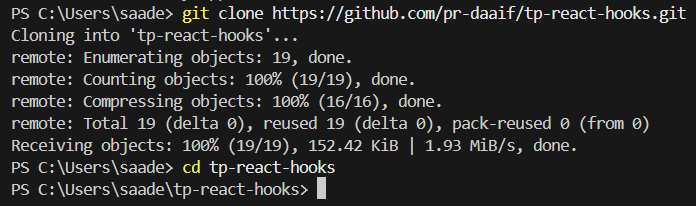
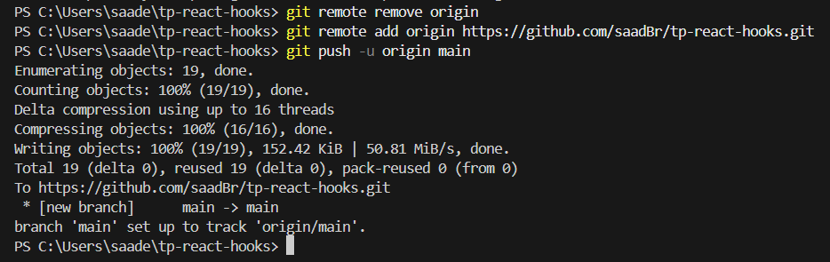
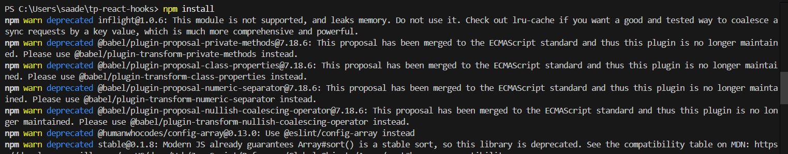
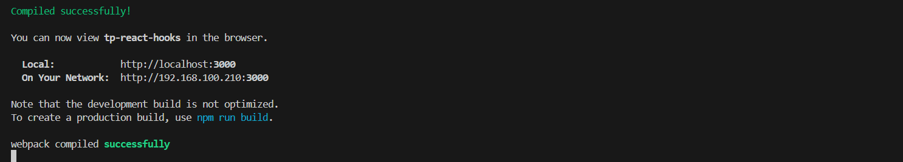

# TP React Hooks - Application de Gestion de Produits

Ce TP a pour objectif de mettre en pratique l'utilisation des Hooks React (useState, useEffect, useContext) ainsi que la création de Hooks personnalisés.

## Installation et configuration initiale

1. Cloner le dépôt :
```bash
git clone https://github.com/pr-daaif/tp-react-hooks.git
cd tp-react-hooks
```


2. Créer votre propre dépôt sur Github et changer le remote :
```bash
# Supprimer le remote origine
git remote remove origin

# Ajouter votre nouveau remote
git remote add origin https://github.com/[votre-username]/tp-react-hooks.git

# Premier push
git push -u origin main
```

3. Installer les dépendances :
```bash
npm install
```


4. Lancer l'application :
```bash
npm start
```


## Instructions pour le TP

Pour chaque exercice :
1. Lisez attentivement l'énoncé
2. Implémentez la solution
3. Testez votre implémentation (pensez à faire des copies d'écran)
4. Mettez à jour la section correspondante dans ce README avec :
   - Une brève explication de votre solution
   - Des captures d'écran montrant le fonctionnement
   - Les difficultés rencontrées et comment vous les avez résolues
5. Commitez vos changements avec un message descriptif

### Exercice 1 : État et Effets 
#### Objectif : Implémenter une recherche en temps réel

- [ ] 1.1 Modifier le composant ProductSearch pour utiliser la recherche
      Mise à jour du composant ProductSearch pour permettre à l'utilisateur de saisir un terme de recherche. 
      Le terme de recherche est transmis du composant enfant ProductSearch au composant parent App via les props. 
      Utilisation de la fonction onChange sur l'élément <input> pour mettre à jour la valeur du searchTerm à chaque modification du champ.
- [ ] 1.2 Implémenter le debounce sur la recherche
      Implementation debounce pour retarder l'execution de la mise à jour de l'état searchItem après un delai de 1s, pour éviter déclenchement de la rechercher pour chaque caractère saisi.
- [ ] 1.3 Documenter votre solution ici
      - Modification du composant ProductSearch : Le composant ProductSearch permet de saisir un terme de recherche. La valeur du champ de recherche est synchronisée avec l'état searchTerm du parent via les props. Chaque changement dans le champ met à jour cet état.
      -Implémentation du debounce avec setTimeout : Pour éviter de déclencher une recherche trop fréquemment, j'ai implémenté un mécanisme de debounce dans ProductSearch. Chaque fois que l'utilisateur saisit un terme, un setTimeout est lancé pour attendre 1s avant de mettre à jour le terme de recherche. Si un autre caractère est saisi avant la fin du délai, le setTimeout précédent est annulé et un nouveau délai commence.
      -Utilisation de clearTimeout : Cette logique permet d'annuler le précédent délai à chaque modification dans le champ de recherche, garantissant ainsi que la recherche ne se déclenche que lorsque l'utilisateur cesse de taper pendant un certain temps.
```
ProductSearch.js

   const ProductSearch = ({ searchTerm, setSearchTerm }) => // utilisé pros passé par le parent

   const [debouncedSearchTerm, setDebouncedSearchTerm] = useState(searchTerm);

   useEffect(()=>{
      const timer = setTimeout(()=>{
         setSearchTerm(debouncedSearchTerm);
      },1000);
      return ()=> clearTimeout(timer);
   },[debouncedSearchTerm,setSearchTerm]); // retarder l'execution pour 1 seconde.

   value={debouncedSearchTerm}
   onChange={(e) => setDebouncedSearchTerm(e.target.value)} // mettre à jour onChange fonction
   

App.js

   <ProductSearch searchTerm={searchTerm} setSearchTerm={setSearchTerm} />
   <ProductList searchTerm={searchTerm} />

Prodcutlist.js

const searchProducts = products.filter((product) =>
   product.title.toLowerCase().includes(searchTerm.toLowerCase())
  ); // ajouter une fonction de recherche

  searchProducts.map(product // map juste les produits recherchés.


```
Recherche fonctionne après la modification du ProdcutSearch.


Etat de recherche avec debounce juste après l'insertion : 

Etat de recherche avec debounce après 1 second : 


### Exercice 2 : Context et Internationalisation
#### Objectif : Gérer les préférences de langue

- [ ] 2.1 Créer le LanguageContext
- [ ] 2.2 Ajouter le sélecteur de langue
- [ ] 2.3 Documenter votre solution ici

```
Pour gérer les préférences de langue, j'ai utilisé le **Context API** de React.

1. **Création du `LanguageContext`** :  
   - J'ai créé un contexte `LanguageContext` dans un fichier `LanguageContext.js`.  
   - Ce contexte fournit deux valeurs : `language` (la langue actuelle) et `changeLanguage` (une fonction pour mettre à jour la langue).  
   - Le `LanguageProvider` est utilisé pour encapsuler l'application et rendre le contexte disponible à tous les composants.

2. **Ajout du sélecteur de langue** :  
   - Un composant `LanguageSelector` a été créé pour permettre à l'utilisateur de changer la langue.  
   - Ce composant utilise le `LanguageContext` pour accéder à la langue actuelle et à la fonction `changeLanguage`.  
   - Lorsque l'utilisateur sélectionne une langue, la fonction `changeLanguage` met à jour l'état du contexte, ce qui déclenche un re-rendu des composants dépendants.

```
English version 

German version


### Exercice 3 : Hooks Personnalisés
#### Objectif : Créer des hooks réutilisables

- [ ] 3.1 Créer le hook useDebounce
- [ ] 3.2 Créer le hook useLocalStorage
- [ ] 3.3 Documenter votre solution ici

```
3.1 Le hook useDebounce permet de retarder l'exécution d'une action (comme une requête ou une mise à jour d'état) jusqu'à ce qu'une période de temps donnée se soit écoulée sans nouvelles modifications.
3.2 Le hook useLocalStorage permet de gérer facilement des données dans le stockage local du navigateur. Il synchronise une valeur avec une clé dans localStorage pour garantir la persistance des données.
```
Etat de recherche avec debounce juste après l'insertion : 

Etat de recherche avec debounce après 1 seconde : 


English version avec local Storage


De version avec local Storage


### Exercice 4 : Gestion Asynchrone et Pagination
#### Objectif : Gérer le chargement et la pagination

- [ ] 4.1 Ajouter le bouton de rechargement
- [ ] 4.2 Implémenter la pagination
- [ ] 4.3 Documenter votre solution ici

```
4.1 Pour l'ajout du button de rechargement :
- Deplacement du fetchProducts en dehors du hook useEffect afin qu'il puisse ètre réutilisé.
- setLoading true : cela garantit que le spinner apparaît lors de la récupération des données, même pendant un rechargement.
- une fois la récupération terminée ou échouée, setloading to false, garantissant un retour visuel précis.
- en appelant fetchProducts, il actualise efficacement la liste des produits tout en affichant le spinner.
- La fonction reload appelle désormais directement fetchProducts, garantissant qu'elle fonctionne sans dupliquer la logique.
- appel useEffect : utilise toujours fetchProducts pour la récupération initiale des données lorsque le composant est monté.
- Ajout button recharger au ProductList component.

```
L'ajout du button de recharge


Chargement lors du clique en recharge

