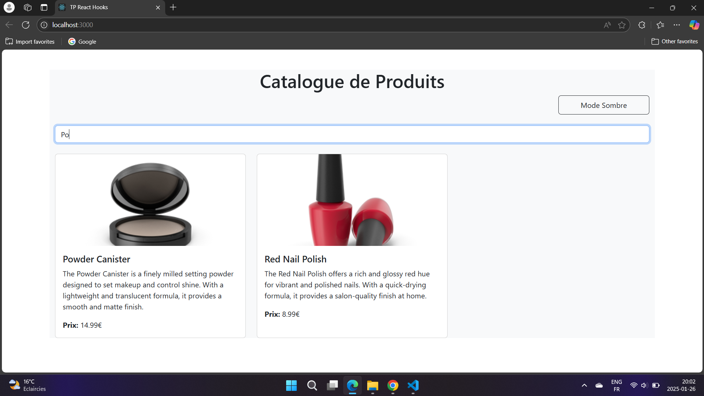
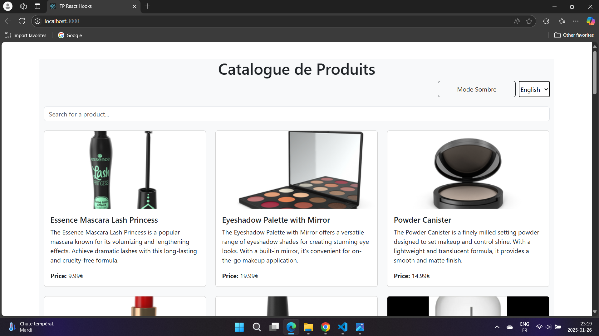
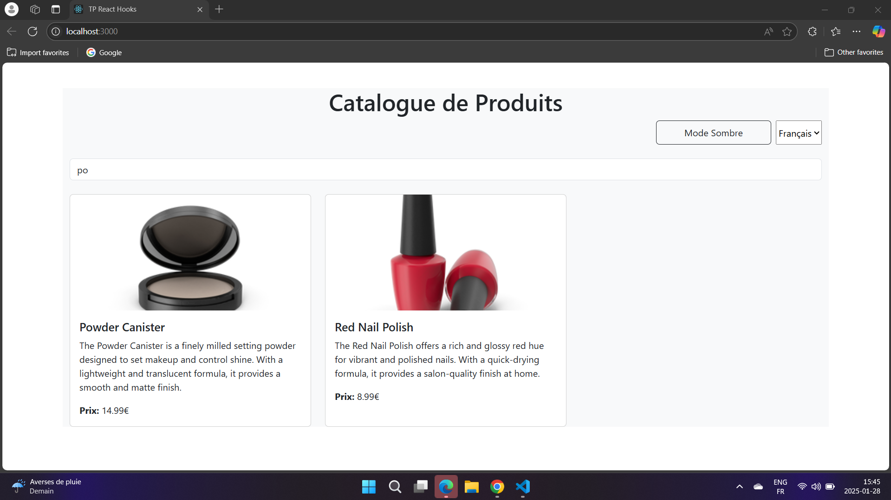
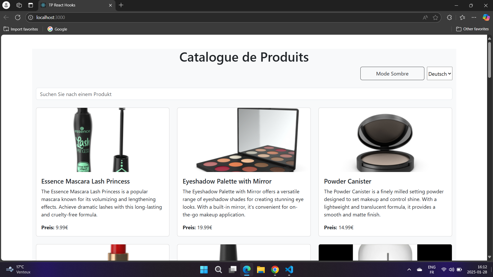
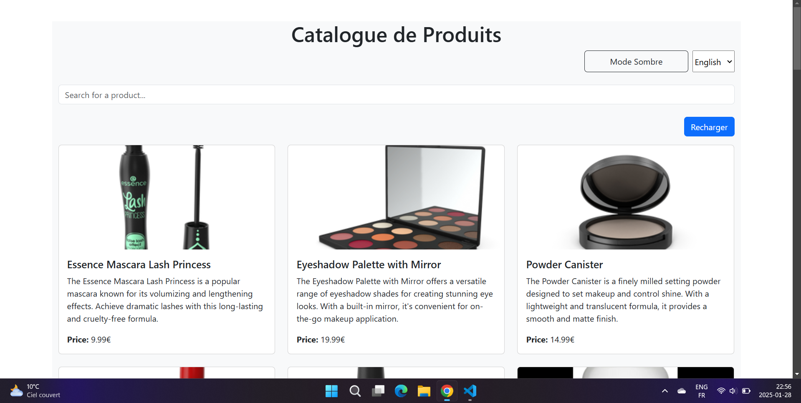
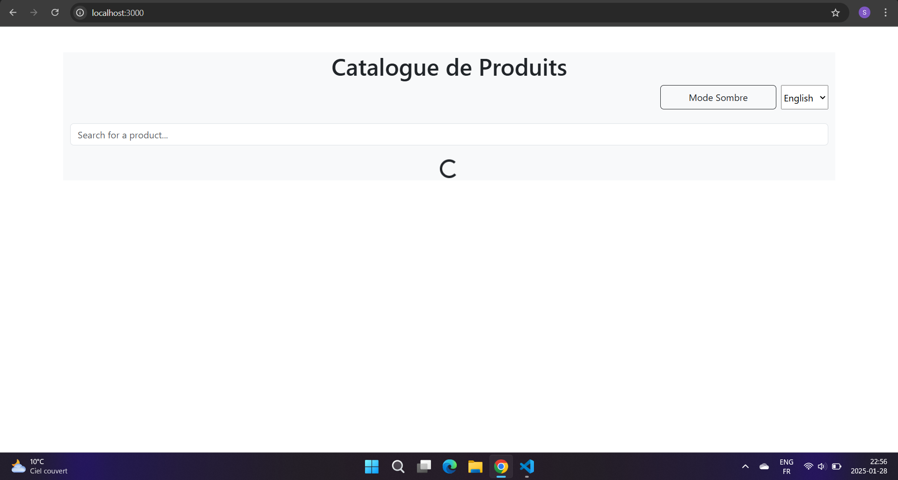

# Author : KHAOULA EL BERMAKI 
# TP React Hooks - Application de Gestion de Produits  

Ce TP a pour objectif de mettre en pratique l'utilisation des **Hooks React** (`useState`, `useEffect`, `useContext`) ainsi que la création de **Hooks personnalisés**.  

---

## 🚀 Installation et Configuration  

### 1️⃣ Cloner le dépôt  

```sh
git clone https://github.com/pr-daaif/tp-react-hooks.git
cd tp-react-hooks
```

### 2️⃣ Changer le remote  

```sh
git remote remove origin
git remote add origin https://github.com/saadbr/tp-react-hooks.git
git push -u origin main
```

### 3️⃣ Installer les dépendances  

```sh
npm install
```

### 4️⃣ Lancer l'application  

```sh
npm start
```


#  Exercices  

##  Exercice 1 : **État et Effets**  

###  Objectif :  
**Implémenter une recherche en temps réel**  

### 🔹 Solution :  

1. **Modification du composant `ProductSearch`**  
   - Le champ de recherche est synchronisé avec l'état `searchTerm` du parent via les props.  

2. **Implémentation du debounce avec `setTimeout`**  
   - Un `setTimeout` attend **1 seconde** avant de mettre à jour `searchTerm`.  
   - Si l'utilisateur saisit un autre caractère avant la fin du délai, l'ancien `setTimeout` est annulé avec `clearTimeout`.


Etat de recherche avec debounce juste après l'insertion :   

Etat de recherche avec debounce après 1 second : 

###  Problèmes rencontrés & Solutions :  
- **Problème :** La recherche était exécutée à chaque frappe de touche, causant trop d’appels API.  
- **Solution :** Utilisation de `setTimeout` et `clearTimeout` pour réduire les requêtes.  

---

## 🿳️ Exercice 2 : **Context et Internationalisation**  

###  Objectif :  
**Gérer les préférences de langue**  

### 🔹 Solution :  

1. **Création du `LanguageContext`**  
   - Contexte `LanguageContext` dans `LanguageContext.js`  
   - Stocke la langue actuelle (`language`) et une fonction `changeLanguage` pour la mise à jour  

2. **Ajout du sélecteur de langue (`LanguageSelector.js`)**  
   - Utilisation du `LanguageContext` pour accéder à `language` et `changeLanguage`  
   - Mise à jour de la langue avec `setLanguage()`  

English version 

German version


---

## 🿠 Exercice 3 : **Hooks Personnalisés**  

### 🎯 Objectif :  
**Créer des Hooks réutilisables (`useDebounce`, `useLocalStorage`)**  

### 🔹 Solution :  

1. **Hook `useDebounce`**  
   - Ajout d’un délai avant la mise à jour d’une valeur.  

2. **Hook `useLocalStorage`**  
   - Permet de stocker des valeurs dans `localStorage` pour éviter la perte de données après un rafraîchissement.  

Etat de recherche avec debounce juste après l'insertion : 

Etat de recherche avec debounce après 1 seconde : 


English version avec local Storage


De version avec local Storage
  

---

## 🿥 Exercice 4 : **Gestion Asynchrone et Pagination**  

### 🎯 Objectif :  
**Gérer le chargement et la pagination**  

### 🔹 Solution :  

1. **Ajout d’un bouton de rechargement**  
   - Un bouton `Recharger` permet de relancer l’appel API.  

2. **Implémentation de la pagination**  
   - Gestion des pages avec `nextPage` et `previousPage`.  

L'ajout du button de recharge


Chargement lors du clique en recharge


Ajout de la pagination

Fonctionement de la pagination en clique sur suivant


---
## Author:
Mohamed Abiaba
